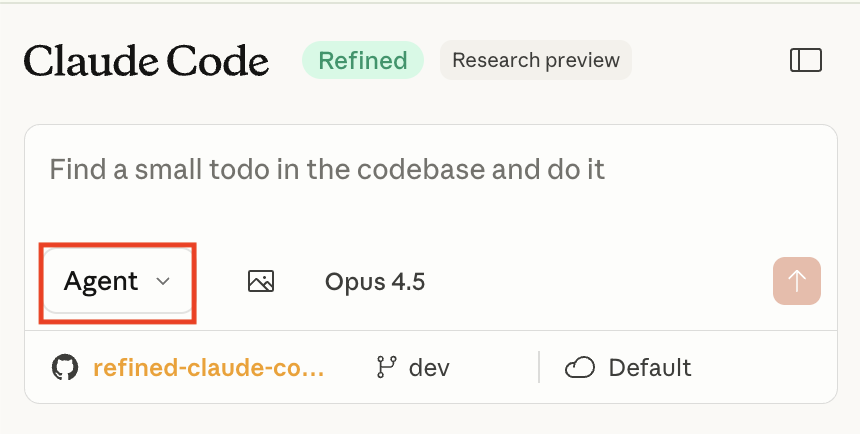
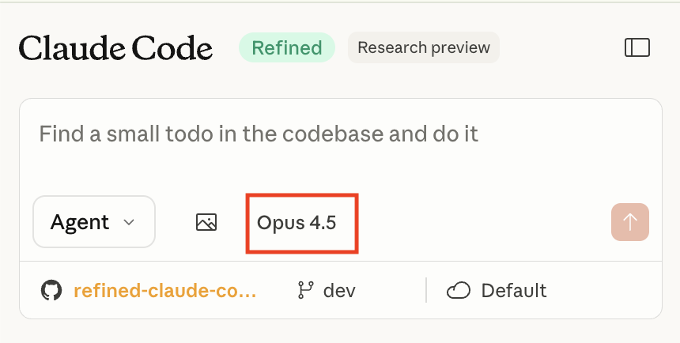
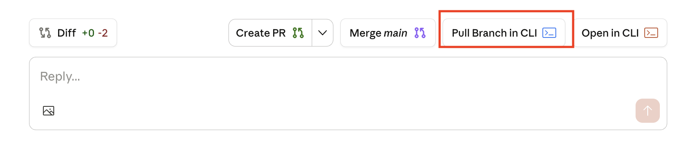
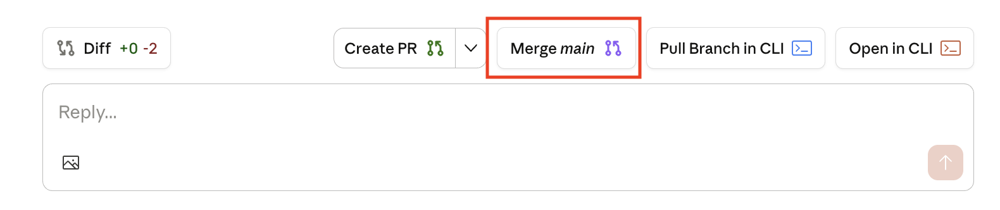
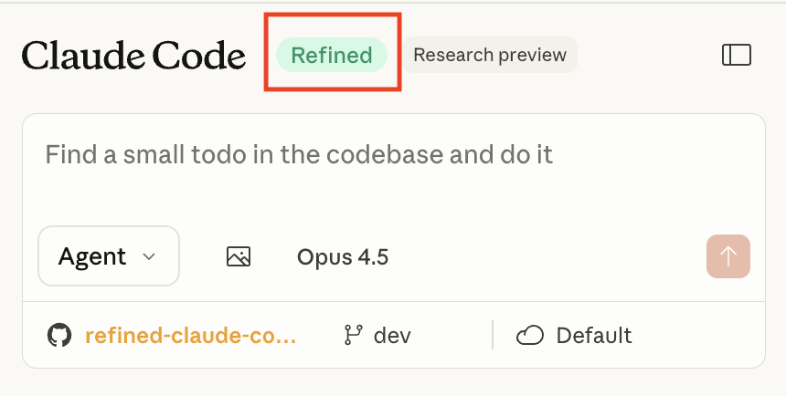

# Refined Claude Code on the Web

A Chrome extension to enhance the Claude web experience with improved code editing capabilities.

> **Naming Inspiration**: The name "Refined Claude Code on the Web" is inspired by the excellent [Refined GitHub](https://github.com/refined-github/refined-github) Chrome extension, which enhances the GitHub experience with thoughtful UI improvements.

> **Recommended Workflow**: This extension is built around [this workflow](https://www.youtube.com/watch?v=3bej6c3O8d0), which inspired most of the "refined" features here.

## The Refined Workflow

1. **Plan** - Use Plan mode to design your approach
2. **Execute** - Switch to Agent mode and let Claude implement the changes
3. **Pull** - Click the "Pull Branch" button to get the code locally
4. **Test** - Run your tests locally
5. **Teleport** - If needed, click "Open in CLI" to continue in your local environment
6. **Repeat** - Iterate until the feature is complete
7. **Create PR** - Open a pull request for review
8. **Resolve conflicts** - If conflicts exist, click the "Merge [main]" button
9. **Test again** - Verify everything works after merging
10. **Merge PR** - Complete the pull request

## Features

### Mode Button (Agent/Plan Toggle)
Switch between Agent and Plan modes directly from the input area. Plan mode uses the `@agent-plan` prefix to enable planning-only responses.



**How it works:**
When you submit a prompt in **Plan mode**, the extension automatically prepends this text to your message:
```
DO NOT write any code yet. I just need the plan for me to review.

use @agent-plan : [your prompt here]
```
Your mode preference is saved and persists across sessions.

**Credits**: Thanks to [@bchan7](https://reddit.com/u/bchan7) and [@batout](https://reddit.com/u/batout) for sharing the [plan mode discovery](https://www.reddit.com/r/ClaudeCode/comments/1p0hypc/changing_to_plan_mode_in_claude_code_on_the_web/).

### Show Actual Model
Displays the actual model being used (e.g., "Opus 4", "Sonnet 4") instead of the generic "..." button.



### Pull Branch Button
Adds a convenient button to copy the `git pull` command for the current branch directly to your clipboard.



### Merge Branch Button
Adds a button next to PRs to copy the merge command for quick branch merging.



### Project Colors
Customize sidebar project entries with distinct colors for easier visual identification.


### Refined Label
Shows a "Refined" badge in the header indicating the extension is active. Click to toggle all features on/off.



## Screenshots

> **Note**: Screenshots are located in the `screenshots/` folder. If you're contributing, please add screenshots for any new features.

## Installation

### From Source (Development)

1. Clone this repository:
   ```bash
   git clone https://github.com/pisrcio/better-claude-code-on-the-web.git
   ```

2. Open Chrome and navigate to `chrome://extensions/`

3. Enable "Developer mode" in the top right corner

4. Click "Load unpacked" and select the cloned repository folder

5. The extension should now be installed and active

## Development

### Prerequisites

- Google Chrome browser
- Basic knowledge of Chrome extension development

### Project Structure

```
├── manifest.json    # Chrome extension manifest (Manifest V3)
├── CLAUDE.md        # Guidance for Claude Code AI assistant
└── README.md        # This file
```

### Making Changes

1. Make your changes to the source files
2. Go to `chrome://extensions/`
3. Click the refresh icon on the extension card to reload

## Contributing

Contributions are welcome! Please feel free to submit a Pull Request.

## License

[MIT License](LICENSE)
